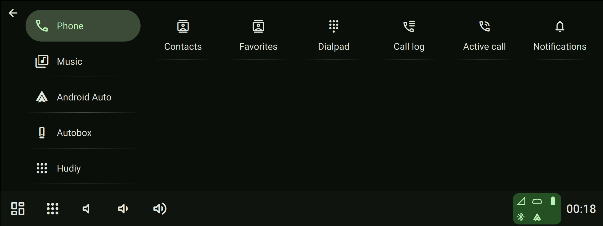

# Description

## Table of Contents

- [Introduction](#introduction)
- [Interface](#interface)
- [Requirements](#requirements)
- [Theming](#theming)
- [Actions](#actions)
- [API](#api)
- [Menu](#menu)
- [Shortcuts](#shortcuts)
- [Web view](#web-view)
- [Applications](#applications)
- [Dashboards](#dashboards)
- [Overlays](#overlays)
- [Bluetooth](#bluetooth)
- [Audio](#audio)
- [Reverse Camera](#reverse-camera)
- [Android Auto](#android-auto)
- [CarPlay](#carplay)
- [Updating](#updating)
- [Multiple screens](#multiple-screens)
- [Companion app](#companion-app)
- [Splash](#splash)
- [x86_64 compatibility](#x86_64-compatibility)

## Introduction

To get Hudiy, visit our website at [hudiy.eu](https://hudiy.eu)

Hudiy is an advanced software designed to help you build and expand your own custom infotainment system.
It provides core functionalities such as communication via the OBD-II interface, hands-free calling, multimedia playback, Android Auto, CarPlay, and much more.

Hudiy supports extensive customization including:

- customizing the appearance of the UI  
- creating your own menus  
- adding shortcuts to frequently used functions  
- creating custom applications written in HTML/JavaScript that can be fully integrated with Hudiy  
- creating custom dashboards and integrate your own widgets written in HTML/JavaScript  
- creating custom overlays written in HTML/JavaScript  

Hudiy exposes an API for external systems to retrieve data, perform actions, and integrate with application features. It also provides a special JavaScript object, `hudiy`, to user-created HTML/JavaScript elements to enable even deeper integration with the application.

The Hudiy application is designed to work on **Raspberry Pi** and **x86_64** hardware. Thanks to the extensive Raspberry Pi/Linux ecosystem, you can choose hardware such as audio devices, screens, or controllers that perfectly match your needs.

## Interface

The interface automatically scales to screen resolution and supports widescreen, standard, and multi-screen configurations.

The application window can operate in fullscreen mode or be configured with a specific size. Elements such as Android Auto projection, CarPlay projection, the reverse camera view, and overlays can each be assigned custom width, height, and x/y coordinates to allow precise positioning on the screen.

The interface can be controlled using both touch and key events. Navigating via keys is mapped to the following events:

- Scroll left
- Scroll right
- Move focus left
- Move focus right
- Move focus up
- Move focus down
- Go back
- Trigger

Supported Key Bindings:

- Right `right arrow`
- Up `up arrow`
- Down `down arrow`
- Left `left arrow`
- Back `escape`
- Scroll left `1`
- Scroll right `2`
- Trigger `enter`
- Home `h`
- Toggle input focus (between projection, native UI and overlays) `t`
- Voice assistant (for projections) `m`
- End voice call `o`
- Answer voice call `p`
- Phone menu `g`
- Go to media player `j`
- Navigation menu `f`
- Play `x`
- Pause `c`
- Previous media `v`
- Next media `n`
- Toggle play/pause `b`

 

## Requirements

### Raspberry Pi

**Mandatory:**

- Raspberry PI 4B or 5
- A clean, unmodified installation of the official Raspberry Pi OS Desktop 64 bit (Bookworm or Trixie)
- 8GB of free storage space
- Display with resolution up to 1920x1080

**Optional:**

- RTL-SDR dongle for FM Radio
- CarlinKit CPC-200 CCPA or Autokit dongle for CarPlay
- Microphone for Hands-Free calling and voice assistants
- USB or Bluetooth ELM327 adapter for OBD-II communication

### x86_64

**Mandatory:**

- CPU compatible with x86 64-bit architecture
- A clean, unmodified installation of the Debian Trixie 64 bit with Desktop (e. g. labwc or Gnome)
- Access to sudo (pasword-less root)
- 8GB of free storage space
- Display with resolution up to 1920x1080

**Optional:**

- RTL-SDR dongle for FM Radio
- CarlinKit CPC-200 CCPA or Autokit dongle for CarPlay
- Microphone for Hands-Free calling and voice assistants
- USB or Bluetooth ELM327 adapter for OBD-II communication
- Hardware compatible with VA-API for hardware acceleration
- Bluetooth module for wireless Android Auto, Hands-Free calling and A2DP
- WiFi module for wireless Android Auto

## Theming

Hudiy follows the guidelines of Material 3 Design.

### Icons

All icons used in Hudiy are defined in fonts to ensure perfect scalability across various resolutions.  
You can provide your own font with icons and use it in configured shortcuts or menus.

See [Main Configuration – Appearance](main_configuration.md#appearance) for details on configuring custom fonts.

### Colors

Material 3 Design defines two themes: dark and light.

For both dark and light themes, you can define a source color and set the contrast level.

  

  

  

See the [Material Theme Builder](https://material-foundation.github.io/material-theme-builder/) for a live preview of colors based on the selected source color.

## Actions

**Actions** are the primary trigger mechanism in Hudiy. Actions serve as triggers for:

- displaying menus  
- displaying dashboards  
- launching applications  
- controlling volume  
- controlling audio playback  
- controlling voice calls  
- controlling the reverse camera  
- controlling Android Auto and CarPlay projections

Actions can be triggered through buttons, widgets, overlays, or API.

### Defining an action

Each dashboard or application you define must also provide the name of an action that will trigger it. In this context, an action can be considered an identifier.

Another way to define an action is through the API. You can register an action via the API and configure, for example, a shortcut to trigger it. When triggered, Hudiy dispatches the action and notifies the client that registered it.

The name of an action must be unique. If you declare more than one action with the same name, the behavior is undefined.

### List of predefined actions

Hudiy includes the following predefined actions:

- **applications_menu**:  
  Display the main menu

- **settings_menu**:  
  Display the settings menu

- **autobox_settings**:  
  Display the Autobox settings menu

- **theme_settings**:  
  Display the theme settings menu

- **android_auto_settings**:  
  Display the Android Auto settings menu

- **backup_cam_settings**:  
  Display the reverse camera settings menu

- **appearance_settings**:  
  Display the appearance settings menu

- **application_settings**:  
  Display the application settings menu

- **sound_settings**:  
  Display the sound settings menu

- **equalizer_settings**:  
  Display the equalizer menu

- **notification_settings**:  
  Display the notification settings menu

- **overlay_settings**:  
  Display the overlay settings menu

- **output_volume_up**:  
  Increase output volume by the configured step

- **output_volume_down**:  
  Decrease output volume by the configured step

- **toggle_output_muted**:  
  Mute or unmute output audio

- **input_volume_up**:  
  Increase input volume by the configured step

- **input_volume_down**:  
  Decrease input volume by the configured step

- **toggle_input_muted**:  
  Mute or unmute input audio

- **equalizer_preset_settings**:  
  Display the equalizer presets menu

- **background_applications**:  
  Display a menu with a list of applications running in the background

- **storage_music_player**:  
  Display the storage music player menu

- **storage_music_browser**:  
  Display the storage music browser menu

- **storage_music_playlist**:  
  Display the storage music playlist menu

- **now_playing_next_track**:  
  Switch to the next track in the current player

- **now_playing_previous_track**:  
  Switch to the previous track in the current player

- **now_playing_toggle_play**:  
  Toggle play/pause in the current player

- **now_playing_pause**:  
  Pause playback in the current player

- **now_playing_play**:  
  Start playback in the current player

- **now_playing_go_to_player**:  
  Display the current player menu

- **fm_radio_player**:  
  Display the FM radio player menu

- **fm_radio_presets**:  
  Display the FM radio presets menu

- **a2dp_music_player**:  
  Display the A2DP (Bluetooth) music player menu

- **status_icon_details**:  
  Display a menu with descriptions of status icons visible on the bottom bar

- **contacts**:  
  Display the contacts menu

- **favorite_contacts**:  
  Display the favorite contacts menu

- **calls_history**:  
  Display the call history menu

- **dialpad**:  
  Display the dialpad menu

- **active_call**:  
  Display the active call menu

- **autobox_player**:  
  Display the Autobox player menu

- **resume_autobox_projection**:  
  Resume projection from the Autobox (CarPlay) device

- **about_autobox_device**:  
  Display a menu with details about the Autobox device

- **connect_autobox_wifi**:  
  Request a wireless connection to the phone from the Autobox device

- **resume_android_auto_projection**:  
  Resume Android Auto projection

- **android_auto_player**:  
  Display the Android Auto player menu

- **connect_android_auto_usb**:  
  Initiate a USB connection to Android Auto

- **connect_android_auto_wifi**:  
  Initiate a wireless connection to Android Auto

- **quit_android_auto**:  
  Request to quit the Android Auto projection

- **answer_call**:  
  Answer an incoming voice call

- **end_call**:  
  End the current voice call

- **remove_paired_devices**:  
  Display the menu to remove Bluetooth paired devices

- **pairing_menu**:  
  Display the Bluetooth pairing menu

- **show_reverse_camera**:  
  Display the reverse camera feed

- **hide_reverse_camera**:  
  Hide the reverse camera feed

- **quit_hudiy**:  
  Quits Hudiy application

- **go_back**:  
  Triggers back action on native UI

- **go_home**:  
  Triggers home action (default dashboard or action configured in Application.defaultAction)

- **go_back_on_web_view_application**:  
  Triggers a browser-like back navigation on the currently visible web application

- **go_forward_on_web_view_application**:  
  Triggers a browser-like forward navigation on the currently visible web application

### Backgrounds

Hudiy allows you to define a custom image file as the background for each menu in both dark and light themes.  
Menus are identified by their corresponding actions.

See [Main Configuration – Theme](main_configuration.md#theme) for instructions on configuring custom backgrounds for menus.

## API

Hudiy exposes an API for external systems to retrieve data, perform actions, and integrate with application features.

There are two endpoints exposed by Hudiy:

- WebSocket
- TCP

Both endpoints use [Protocol Buffers](https://protobuf.dev/) for communication protocol definition. Protobuf messages are packed into frames with the following structure:

### Frame format

|               | Field 1                                  | Field 2                                  | Field 3                                  | Field 4                      |
|---------------|------------------------------------------|------------------------------------------|------------------------------------------|------------------------------|
|**Description**| Size of the Protocol Buffers byte stream | Message ID                               | Reserved                                 | Protocol Buffers byte stream |
|**Size**       | 32-bit unsigned integer (little endian)  | 32-bit unsigned integer (little endian)  | 32-bit unsigned integer (little endian)  | n bytes                      |

### Features

- Exchanging metadata for now playing media, navigation maneuvers, projection status (Android Auto, CarPlay), and phone data (voice calls, battery level, signal strength)
- Controlling the reverse camera
- Displaying custom status icons
- Displaying custom notifications
- Displaying custom toast messages
- Controlling audio focus
- Injecting keystrokes
- Injecting cover art
- Switching between dark and light themes
- Controlling overlay visibility
- Registering and dispatching actions
- Switching equalizer presets
- Querying ELM327 OBD-II device

For more details about protocol please check [Api](api/Api.proto) definition.

Configuration options for the Api are described in [Main Configuration - Api](main_configuration.md#api) documentation.

## Menu

The applications menu serves as the primary interface for launching actions. The applications menu has a default structure that can be fully customized.

All items in the applications menu can be organized into categories, though this is not mandatory.

Each menu item has a configurable label, icon, category, and associated action.

  

  

  

### Applications Menu configuration

The configuration of the applications menu is stored in $HOME/.hudiy/share/config/applications_menu.json.

It contains two arrays: `categories` and `items`.

The `categories` array stores objects with the following structure:

- `isDefault`  
Boolean value that determines whether the category is the default one. If no default category is defined, the application assumes the first one is the default. The default category will be automatically selected when the menu is opened.

- `iconFontFamily`  
Font family used for the category icon.

- `iconName`  
Identifier of the icon within the font.

- `label`  
Label of the category, visible in the menu.

The `items` array stores objects with the following structure:

- `categories`  
*Array that stores the labels of the categories the item is assigned to. An item can be assigned to multiple categories or to none of them.*

- `iconFontFamily`  
Font family used for the item icon.

- `iconName`  
Identifier of the icon within the font.

- `label`  
Label of the item, visible in the menu.

- `action`  
Action that will be triggered when the item is pressed.

## Shortcuts

Shortcuts for frequently used actions can be placed on the bottom bar.

Each shortcut has a configurable icon and an associated action.

The available space on the bottom bar can be used for shortcuts, but it is limited by the status icon container.

 

### Shortcuts configuration

The configuration of the shortcuts is stored in $HOME/.hudiy/share/config/shortcuts.json.

It contains `shortcuts` array with objects of following structure:

- `iconFontFamily`  
Font family used for the item icon.

- `iconName`  
Identifier of the icon within the font.

- `action`  
Action that will be triggered when the shortcut is pressed.

## Web view

All custom applications, widgets, and overlays written in HTML/JavaScript are displayed in the Hudiy interface using an embedded web view based on the Chromium engine.

The web view can display local HTML files or load web pages from a provided URL.

All web views can communicate with Hudiy via its API. Hudiy also exposes a special `hudiy` object with a set of callbacks and properties that can be used to match the current UI theme or handle input events.

Additionally, Hudiy integrates with the [Media Session API](https://developer.mozilla.org/en-US/docs/Web/API/MediaSession) to control audio focus and playback, and to obtain media metadata.

  

All browsing data like cache and storage are located in $HOME/.hudiy/cache/web and $HOME/.hudiy/storage/web directories.

*Note: DRM support plugins are not included with Hudiy, are untested, and must be configured manually by the user.*

### Input events

Web view elements can be controlled using both touch and key events. Handling key events is optional in web views, but to ensure the best consistency with the native UI, it is recommended to implement it.

Touch events are handled directly by the Chromium engine, whereas UI-relevant key events (e.g., directional keys, selection keys) are delivered to the web view via a set of dedicated callbacks provided by the application.

Users can switch between touch and key input at any time. Both the switch event and the current input method are exposed via callbacks and properties in the `hudiy` object.

Possible input events:

- Scroll left
- Scroll right
- Move focus left (reserved only for applications)
- Move focus right (reserved only for applications)
- Go back (reserved only for applications)

#### Input focus

UI elements are divided into input scopes. Examples of input scopes include the bottom bar, dashboards, or menus (like main menu, settings, music players, etc). Each input scope contains controls that the user can highlight and press to trigger an action. Switching between input scopes effectively changes the input focus. Only one input scope can have active focus at a time. Highlighting should be handled internally by the web view.

From **Hudiy's** perspective, each web view (overlay, widget, or application) is treated as a separate input scope.

The input focus remains on the current input scope even after switching to touch input, but no interface control callbacks will be triggered until the user switches back to key input. Switching back to key input is indicated by another invocation of the `hudiy.onActivatedChanged` callback and the value of the `hudiy.activated` property.

### `hudiy` Object

#### `hudiy.onColorSchemeChanged`

**Type:** `function`  
**Description:**  
*Callback invoked when the color scheme (e.g., dark/light mode or source color) changes.*

**Parameters:**  
*None*

**Return value:**  
*None*

#### `hudiy.onInputFocusChanged`

**Type:** `function`  
**Description:**  
*Callback invoked when state of the input focus for web view changed. Current state is stored in `hudiy.inputFocus` property.*

**Parameters:**  
*None*

**Return value:**  
*None*

#### `hudiy.onActivatedChanged`

**Type:** `function`  
**Description:**  
*Callback invoked when the user changes the control method to either touch or key input. Current state is stored in `hudiy.activated` property.*

**Parameters:**  
*None*

**Return value:**  
*None*

#### `hudiy.onMoveToNextControl`

**Type:** `function`  
**Description:**  
*Callback invoked when user wants to highlight next control.*

**Parameters:**  
*None*

**Return value:**  
*Boolean. `true` when next control was highlighted, `false` otherwise.*

#### `hudiy.onMoveToPreviousControl`

**Type:** `function`  
**Description:**  
*Callback invoked when user wants to highlight previous control.*

**Return value:**  
*Boolean. `true` when previous control was highlighted, `false` otherwise.*

**Parameters:**  
*None*

#### `hudiy.onTriggered`

**Type:** `function`  
**Description:**  
*Callback invoked when the user attempts to press the currently highlighted control. Highlighting should be handled internally by the web view.*

**Parameters:**  
*None*

**Return value:**  
*None*

#### `hudiy.onAttached`

**Type:** `function`  
**Description:**  
*Callback invoked when the web view has finished loading and the Hudiy application has been attached to it.*

**Parameters:**  
*None*

**Return value:**  
*None*

#### `hudiy.onGoLeft`

**Type:** `function`  
**Description:**  
*Callback invoked when the user attempts to navigate left within the web view. Available only for custom applications.*

**Parameters:**  
*None*

**Return value:**  
*None*

#### `hudiy.onGoRight`

**Type:** `function`  
**Description:**  
*Callback invoked when the user attempts to navigate right within the web view. Available only for custom applications.*

**Parameters:**  
*None*

**Return value:**  
*None*

#### `hudiy.onGoBack`

**Type:** `function`  
**Description:**  
*Callback invoked when the user attempts to navigate back within the web view. Available only for custom applications.*

**Parameters:**  
*None*

**Return value:**  
*Boolean. `true` when the application utilized the event (e.g., it navigated back internally), `false` when the application didn’t utilize the event (then Back in the native UI will be triggered).*

#### `hudiy.inputFocus`

**Type:** `boolean`  
**Description:**  
*Indicates the current state of input focus. `true` means the web view has focus; `false` means it does not.*

#### `hudiy.activated`

**Type:** `boolean`  
**Description:**  
*Indicates whether key input is currently being used. `true` means the user is controlling the interface via key input; `false` means it has switched to touch input.*

### `hudiy.colorScheme` Object

#### `hudiy.colorScheme.darkThemeEnabled`

**Type:** `boolean`  
**Description:**  
*Indicates whether the dark theme is enabled. `true` means the dark theme is currently in use; `false` means the light theme is active.*

#### `hudiy.colorScheme.lightContrastLevel`

**Type:** `number`  
**Description:**  
*Indicates the color contrast level for the light theme, in the range [-1.0, 1.0].*

#### `hudiy.colorScheme.darkContrastLevel`

**Type:** `number`  
**Description:**  
*Indicates the color contrast level for the dark theme, in the range [-1.0, 1.0].*

### Available color definitions. Each property stores a color value in hexadecimal format

#### `hudiy.colorScheme.primaryPaletteKeyColor`

#### `hudiy.colorScheme.secondaryPaletteKeyColor`

#### `hudiy.colorScheme.tertiaryPaletteKeyColor`

#### `hudiy.colorScheme.neutralPaletteKeyColor`

#### `hudiy.colorScheme.neutralVariantPaletteKeyColor`

#### `hudiy.colorScheme.background`

#### `hudiy.colorScheme.onBackground`

#### `hudiy.colorScheme.surface`

#### `hudiy.colorScheme.surfaceDim`

#### `hudiy.colorScheme.surfaceBright`

#### `hudiy.colorScheme.surfaceContainerLowest`

#### `hudiy.colorScheme.surfaceContainerLow`

#### `hudiy.colorScheme.surfaceContainer`

#### `hudiy.colorScheme.surfaceContainerHigh`

#### `hudiy.colorScheme.surfaceContainerHighest`

#### `hudiy.colorScheme.onSurface`

#### `hudiy.colorScheme.surfaceVariant`

#### `hudiy.colorScheme.onSurfaceVariant`

#### `hudiy.colorScheme.inverseSurface`

#### `hudiy.colorScheme.inverseOnSurface`

#### `hudiy.colorScheme.outline`

#### `hudiy.colorScheme.outlineVariant`

#### `hudiy.colorScheme.shadow`

#### `hudiy.colorScheme.scrim`

#### `hudiy.colorScheme.surfaceTint`

#### `hudiy.colorScheme.primary`

#### `hudiy.colorScheme.onPrimary`

#### `hudiy.colorScheme.primaryContainer`

#### `hudiy.colorScheme.onPrimaryContainer`

#### `hudiy.colorScheme.inversePrimary`

#### `hudiy.colorScheme.secondary`

#### `hudiy.colorScheme.onSecondary`

#### `hudiy.colorScheme.secondaryContainer`

#### `hudiy.colorScheme.onSecondaryContainer`

#### `hudiy.colorScheme.tertiary`

#### `hudiy.colorScheme.onTertiary`

#### `hudiy.colorScheme.tertiaryContainer`

#### `hudiy.colorScheme.onTertiaryContainer`

#### `hudiy.colorScheme.error`

#### `hudiy.colorScheme.onError`

#### `hudiy.colorScheme.errorContainer`

#### `hudiy.colorScheme.onErrorContainer`

#### `hudiy.colorScheme.primaryFixed`

#### `hudiy.colorScheme.primaryFixedDim`

#### `hudiy.colorScheme.onPrimaryFixed`

#### `hudiy.colorScheme.onPrimaryFixedVariant`

#### `hudiy.colorScheme.secondaryFixed`

#### `hudiy.colorScheme.secondaryFixedDim`

#### `hudiy.colorScheme.onSecondaryFixed`

#### `hudiy.colorScheme.onSecondaryFixedVariant`

#### `hudiy.colorScheme.tertiaryFixed`

#### `hudiy.colorScheme.tertiaryFixedDim`

#### `hudiy.colorScheme.onTertiaryFixed`

#### `hudiy.colorScheme.onTertiaryFixedVariant`

## Applications

Functionalities of the Hudiy can be extended by custom applications. You can create your own applications in HTML/JavaScript and integrate them with Hudiy using [Web view](#web-view).

Custom applications can be used, for example:

- to control various functions of your vehicle, such as climate control or comfort module
- to present data gathered from the OBD-II interface via the [Api](#api)
- to display data from any other vehicle-specific interface
- to build an advanced camera system

... and much more.

*Note: The integration of any vehicle-specific features is the responsibility of the user.*

You can also load a link to any web page, such as YouTube Music, and use it as a player for your favorite music.

  

  

### Applications configuration

The configuration of the applications is stored in $HOME/.hudiy/share/config/applications.json.

It contains `applications` array with objects of following structure:

- `action`  
Action that identifies the application and allows it to be displayed, e.g., from the menu, a shortcut, or via the API.

- `url`  
URL to either a local HTML file (`file://`) or a web URL (`http://` or `https://`) that will be loaded.

- `allowBackground`  
Boolean value. A value of `true` means that the loaded HTML content and the corresponding Chromium session are preserved until the application is closed via the background applications menu. A value of `false` means that the loaded HTML content and the Chromium session will be destroyed when the application goes off-screen.

  *Note: HTML content can use a significant amount of RAM. Consider preserving it in the background only if truly needed.*

- `controlAudioFocus`  
Boolean value. A value of `true` indicates that the HTML content loaded in the web view can play audio and requires control over audio focus. A value of `false` means that audio will never be played from the loaded HTML content.

- `audioStreamCategory`  
Type of audio played from the loaded HTML content. The audio type determines how audio focus will be controlled. The category can be one of the following:
  - `"NONE"`
  - `"ENTERTAINMENT"`
  - `"COMMUNICATION"`
  - `"NOTIFICATION"`

- `zoomFactor`
Zoom factor for the web view. Accepted values are within the range from 0.25 to 5.0. The default factor is 1.0 (no zoom). This can be useful to enlarge interface elements on the displayed page.

### Widgets

Widgets are part of the dashboard. Hudiy includes predefined widgets such as:

- Phone status
- Now playing media
- Navigation
- Date and time

Widgets can also load a local HTML file or a web URL in a web view.

Widgets visible on the dashboard have two width options (narrow and wide) and three height options (small, medium, and large). Each widget can therefore have one of the following sizes:

- small narrow

- medium narrow

- large narrow

- small wide

- medium wide

- large wide

## Dashboards

Dashboards are customizable screens for arranging and displaying widgets. Each dashboard can present different types of information or controls, such as real-time data, system status, media playback, or sensor readings. Multiple dashboards can be created, modified, and switched between for different use cases.

Hudiy includes predefined widgets, but users can also create their own using HTML/JavaScript, and add them to the dashboard as web views.

Every dashboard must have a unique action name across the entire application that serves as its identifier, allowing it to be displayed—for example, from the applications menu or via shortcuts.

Dashboard count is unlimited.

### Dashboards configuration

The configuration of the dashboards is stored in $HOME/.hudiy/share/config/dashboards.json.

It contains `dashboards` array with objects of following structure:

- `isDefault`  
Boolean value that determines whether the dashboard is the default one. If no default dashboard is defined, the application assumes the first one is the default. The default dashboard will be used as the main screen.

- `iconFontFamily`  
Font family used for the item icon.

- `iconName`  
Identifier of the icon within the font.

- `action`  
Action that identifies the dashboard and allows it to be displayed, e.g., from the menu, a shortcut, or via the API.

- `widgets`  
Array of objects that define the widgets displayed on the dashboard. The widgets are arranged from top to bottom starting from top-left corner. Objects in the array have the following structure:

  - `type`  
  Type of the widget. It can be one of the following:
    - `"PLACEHOLDER"` - An empty space that can be useful for custom arrangement of widgets. It can't receive input focus.
    - `"WEB"` - Web view that loads the given URL and can receive input focus.
    - `"WEB_STATIC"` - Web view that loads the given URL and can't receive input focus.
    - `"DATE_TIME"` - Built-in widget that displays the date and time.
    - `"NOW_PLAYING"` - Built-in widget that displays the metadata of the currently playing media.
    - `"PHONE"` - Built-in widget that displays the name of the connected phone and provides quick access to the dial pad, contact list, and call history.
    - `"NAVIGATION"` - Built-in widget that displays details of the current navigation maneuver from Android Auto.

  - `size`  
  One of the following widget's size:
    - `"SMALL_NARROW"`
    - `"MEDIUM_NARROW"`
    - `"LARGE_NARROW"`
    - `"SMALL_WIDE"`
    - `"MEDIUM_WIDE"`
    - `"LARGE_WIDE"`

  - `url`  
  URL to load for `WEB` or `WEB_STATIC` widgets. It can be either a local HTML file (`file://`) or a web URL (`http://` or `https://`).

  - `controlAudioFocus`  
  Boolean value. Applicable to `WEB` and `WEB_STATIC` widgets. A value of `true` indicates that the HTML content loaded in the web view can play audio and requires control over audio focus. A value of `false` means that audio will never be played from the loaded HTML content.

  - `audioStreamCategory`  
  Applicable to `WEB` and `WEB_STATIC` widgets. Type of audio played from the loaded HTML content. The audio type determines how audio focus will be controlled. The category can be one of the following:
    - `"NONE"`
    - `"ENTERTAINMENT"`
    - `"COMMUNICATION"`
    - `"NOTIFICATION"`

## Overlays

Overlays are interface elements that appear on top of all other content. They can, for example, provide data display and quick-access controls.

Overlays have four visibility modes:

- NONE  
*The overlay is hidden.*

- PROJECTION_ONLY  
*The overlay is displayed only when a projection (Android Auto or CarPlay) is active.*

- NATIVE_UI_ONLY  
*The overlay is displayed only on the native UI.*

- ALWAYS  
*The overlay is displayed on both the native UI and projection.*

Custom overlays can be created in HTML/JavaScript and displayed in web views.

Each overlay can have a custom width, height, and screen position (x, y). It can be repositioned using drag-and-drop gestures, the Left, Right, Up, and Down key strokes. To prevent interference with HTML content, drag-and-drop for custom overlays is activated after a long press.

Hudiy includes two built-in overlays: volume controls and navigation.

Overlays can be also used to create split-screen layouts, where, for example, the native UI is shown on one side (e.g., the left) and the overlay is shown on the other side (e.g., the right), displaying additional information or controls.

Toggling input focus between overlays, projection, and native UI is triggered by the `t` key or the `KEY_TYPE_TOGGLE_INPUT_FOCUS` key event from the API.

  

  

  

  

  

### Overlays Configuration

The configuration of the overlays is stored in $HOME/.hudiy/share/config/overlays.json.

It contains `overlays` array with objects of following structure:

- `identifier`  
Identifier of the overlay. Each overlay must have a unique identifier. It is used to control the visibility.

- `width`  
Width of the overlay.

- `height`  
Height of the overlay.

- `x`  
X position of the overlay within the application window. Position of the overlay can also be changed using drag-and-drop gestures or the Left, Right, Up, and Down keystrokes.

- `y`  
Y position of the overlay within the application window. Position of the overlay can also be changed using drag-and-drop gestures or the Left, Right, Up, and Down keystrokes.

- `visibility`  
One of the following visibilities:
  - `"NONE"`
  - `"ALWAYS"`
  - `"NATIVE_UI_ONLY"`
  - `"PROJECTION_ONLY"`

- `url`  
URL to either a local HTML file (`file://`) or a web URL (`http://` or `https://`) that will be loaded.

- `controlAudioFocus`  
Boolean value. A value of `true` indicates that the HTML content loaded in the web view can play audio and requires control over audio focus. A value of `false` means that audio will never be played from the loaded HTML content.

- `audioStreamCategory`  
Type of audio played from the loaded HTML content. The audio type determines how audio focus will be controlled. The category can be one of the following:
  - `"NONE"`
  - `"ENTERTAINMENT"`
  - `"COMMUNICATION"`
  - `"NOTIFICATION"`

- `visibleOnActions`  
Array of actions on which the overlay will be displayed, based on its visibility settings. You can configure an overlay to appear, for example, only on the storage music player or on a specific dashboard. If left empty, the overlay will be displayed on all screens according to its visibility configuration.

- `staticPosition`  
Boolean value. A value of `true` disables Drag & Drop and keystrokes (Left, Right, Up, Down) for positioning the overlay on the screen. A value of `false` enables them.

#### Built-in overlays configuration

- `navigationOverlayPosition`  
Object with `x` and `y` coordinates of the navigation overlay position.

- `volumeOverlayPosition`  
Object with `x` and `y` coordinates of the volume overlay position.

- `navigationOverlayVisibility`  
Navigation overlay visibility.

- `navigationOverlayOpacity`  
Navigation overlay opacity [%].

- `volumeOverlayVisibility`  
Volume overlay visibility.

#### Positioning configuration

- `xStep`  
The value added to or subtracted from the X-coordinate when moving the overlay via keystrokes.

- `yStep`  
The value added to or subtracted from the Y-coordinate when moving the overlay via keystrokes.

## Bluetooth

Hudiy supports Bluetooth with A2DP and AVRCP for media playback and HFP for hands-free calling. The application can also access contacts and call history on a connected phone.

Bluetooth audio, including A2DP for high-quality media playback and HFP for hands-free communication, is managed by PipeWire. PipeWire handles audio routing, synchronization, and system audio integration.

You can pair and unpair Bluetooth devices directly in Hudiy. It is recommended to disable other Bluetooth agents to avoid potential conflicts.

### Cover art

Starting from **Raspberry Pi OS/Debian Trixie**, the Bluetooth stack includes experimental support for fetching track cover art.
To enable this functionality, experimental features must be activated in the BlueZ system configuration.

The Bluetooth configuration is stored in the **/etc/bluetooth/main.conf** file. Enabling experimental Bluetooth stack features is done by setting the **Experimental = true** parameter in the **[General]** section of this file.

Additionally, Android phones must have the AVRCP protocol version set to 1.6. The AVRCP version can be selected in the Developer settings (a reconnect may be required after change).

*Note: Not all media players support sending cover art or proper metadata at all.*

## Audio

Hudiy exposes configuration options for two types of sinks: the volume sink and the playback sink. Separate sinks can be configured for audio playback and volume control.

This separation allows greater flexibility — for example, users can route audio through a virtual sink provided by a PipeWire plugin (such as the equalizer or other audio effects), while controlling volume on a different sink directly associated with a physical audio device.

Based on the PipeWire configuration, Hudiy can detect the following speaker setups:

- Stereo  
*FRONT_LEFT, FRONT_RIGHT*

- 4.0  
*FRONT_LEFT, FRONT_RIGHT, REAR_LEFT, REAR_RIGHT*

- 4.1  
*FRONT_LEFT, FRONT_RIGHT, REAR_LEFT, REAR_RIGHT, SUBWOOFER*

Depending on the detected setup, it is possible to control balance, fade, and subwoofer balance in the audio settings.

For more details about audio configuration see [Main Configuration](main_configuration.md)

### Audio focus

Hudiy implements an audio focus mechanism to consistently manage all playing audio streams (Storage Music, Web, Android Auto, Autobox, FM Radio, voice calls, navigation, etc.). When you play music from one source (e.g., Storage Music Player) and then start playback from another source (e.g., Android Auto), Hudiy automatically pauses the previous source and grants audio focus to the new one.

Another feature of Audio Focus is the automatic ducking (lowering) and restoring of the audio stream volume when, for example, navigation prompts or notification sounds are played.

Hudiy also handles audio focus for voice calls and voice assistants. If a voice call starts or a voice assistant is activated during audio playback, Hudiy automatically pauses the music and resumes it after the voice session ends.

Using the API, you can integrate your applications with the audio focus mechanism in Hudiy. For HTML/JavaScript, audio focus is automatically integrated via the Media Session API.

The audio focus mechanism distinguishes 3 basic audio stream categories:

- `ENTERTAINMENT` - for streams like music players (indefinite)
- `COMMUNICATION` - for streams like voice calls/voice assistants (transient)
- `NOTIFICATION` - for streams like navigation/notifications (ducking)

### Equalizer

The equalizer is implemented as a PipeWire plugin.

The equalizer features 15 adjustable frequency bands, allowing precise control over the audio spectrum. Each band's gain can be individually configured to shape the overall sound. This allows for custom tuning or the use of predefined equalizer presets.

Equalizer presets are defined in the configuration file. Unlimited equalizer presets can be defined.

  

### Players

Hudiy supports playback from multiple audio sources, including:

- Audio files
- Android Auto
- CarPlay
- FM Radio
- A2DP (Bluetooth)

For each audio source, Hudiy attempts to retrieve metadata such as artist, album, title, duration, and cover art. In the case of FM Radio, it can also decode RDS data, including Programme Service and Radio Text.

If cover art is not available from the source metadata, Hudiy can request it from a client connected via the API, using the artist, album, and title as search parameters.

RDS decoding can be enabled or disabled through the configuration.

## Reverse camera

Hudiy displays the camera feed on the screen using GStreamer. The camera feed takes precedence and, when active, is shown above all other visible elements.

The width, height, and position (x, y) of the render surface can be configured in the [Main Configuration - Reverse Camera](main_configuration.md#reversecamera), along with the GStreamer pipeline used to retrieve the stream from the camera.

The visibility of the camera feed surface can be controlled through corresponding actions or the API.

Camera feeds can alternatively be displayed using web views and the [MediaDevices](https://developer.mozilla.org/en-US/docs/Web/API/MediaDevices) API.

## Android Auto

Hudiy supports emulation of an Android Auto-capable head unit. Android Auto can be connected via both USB and Wi-Fi.

For wireless connections, Hudiy can create a Wi-Fi hotspot that the phone connects to in order to stream projection data.

Alternatively, it is also possible to use an existing external Wi-Fi network instead of the built-in hotspot. See [Main Configuration - Hotspot](main_configuration.md#hotspot) for more details.

The width, height, and position (x, y) of the render surface can be configured in the [Main Configuration - Android Auto](main_configuration.md#androidauto).

Hudiy can retrieve media metadata and navigation information from Android Auto, and exposes this data through the API.

## CarPlay

CarPlay projection is served via CarlinKit CPC200-CCPA dongle. CarlinKit CPC200-CCPA supports both USB and Wi-Fi connections.

The width, height, and position (x, y) of the render surface can be configured in the [Main Configuration - Autobox](main_configuration.md#autobox).

Hudiy can retrieve media metadata from CarlinKit CPC200-CCPA, and exposes this data through the API.

## Updating

Hudiy includes an embedded updater accessible via the command line.
The updater application is located at `$HOME/.hudiy/share/updater`

The updater performs an incremental update (version by version).

The current version can be found in Settings (Menu -> Hudiy -> Settings -> About).

To distinguish between Hudiy versions for different Raspberry Pi OS/Debian releases, we introduced the following versioning scheme:  

- 1.x - Hudiy for Bookworm
- 2.x - Hudiy for Trixie
- 3.x - Hudiy for the next Raspberry Pi OS/Debian release in the future

## Multiple screens

Hudiy provides advanced multi-display support.

It allows independent configuration of position and size for the UI, Android Auto / CarPlay projections, and all overlays — offering complete control over screen layout.

For more information on setting the size and position of these components, see [Main configuration](main_configuration.md).

## Companion app

Hudiy comes with a companion app available for Android devices that connects to the system via Bluetooth.

It allows you to display notifications from selected apps directly on the Hudiy screen.
It also provides time synchronization, which is especially useful on systems without a real-time clock (RTC).

The companion app does not collect, store, or transmit any personal data.

### Permissions

- **QUERY_ALL_PACKAGES**  
Permission is required to retrieve the list of installed applications in order to allow the user to select which ones can display notifications on the Hudiy screen.

- **BLUETOOTH**  
Permission is required to manage the list of paired devices that can connect with the companion app and to establish a Bluetooth connection with the device itself.

- **FOREGROUND_SERVICE**  
Permission is required to monitor Bluetooth device connections and automatically connect to approved devices.
  

## Splash

After the system loads, the splash application is responsible for starting Hudiy. By default, the splash application displays the "Hudiy" text during loading. Using splash application arguments, you can provide a path to an image (e.g., JPG/PNG/GIF) that will be displayed instead of the “Hudiy” text. The image will be shown in the center of the splash window while preserving its original dimensions (width and height).

List of available arguments:  

- `--delay`  
  Sets the time in milliseconds for which the splash application will remain active after Hudiy starts.

- `--logo`  
  Absolute path to an image file that will be displayed instead of the “Hudiy” text.

The Hudiy launch script is located at `$HOME/.hudiy/share/hudiy_run.sh`. Depending on the window compositor, the script is triggered from `$HOME/.config/labwc/autostart` or `$HOME/.config/autostart/hudiy.desktop`.

During the startup of the Operating System, the splash screen is handled by [Plymouth](https://www.freedesktop.org/wiki/Software/Plymouth/).

## x86_64 compatibility

As of version 2.2, Hudiy also supports the x86 64-bit architecture. The currently supported Operating System is Debian Trixie 64-bit with a graphical environment (e.g., Gnome or labwc).

Since the installation, configuration and updating process for Hudiy requires root privileges, access to sudo is necessary. In Debian, sudo access is automatically provided when a password is not set for the root user. Please keep that in mind during OS installation and do not set the root password.

Hudiy utilizes the VA-API (Video Acceleration API) for hardware acceleration. Therefore, for a better user experience, we recommend running Hudiy on platforms that support VA-API (<https://www.intel.com/content/www/us/en/developer/articles/technical/linuxmedia-vaapi.html>).

**We do not recommend and officially do not support** running Hudiy on Virtual Machines (e.g., QEMU, VirtualBox, or VMWare). Virtual Machines do not provide sufficient hardware support for handling UI (OpenGL) and video rendering, and may also cause issues with PipeWire. Any additional system configuration required on a Virtual Machine is the responsibility of the user.
