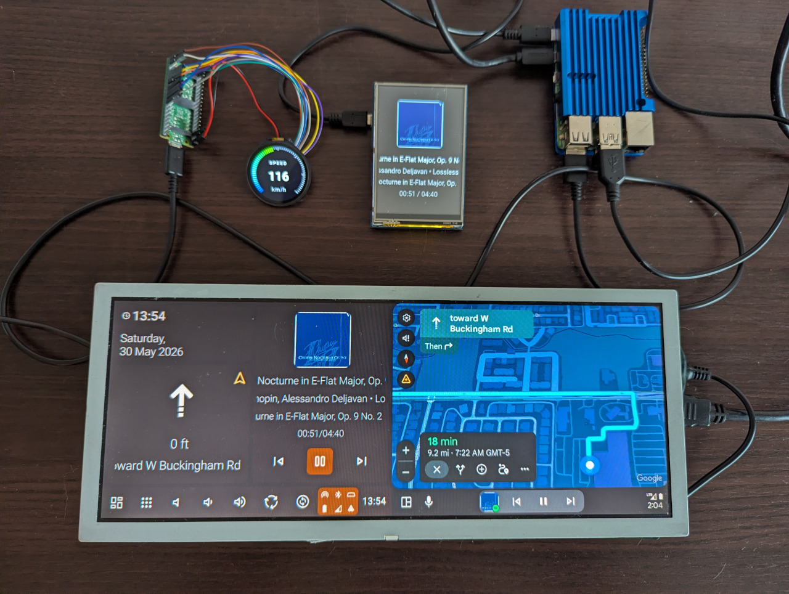
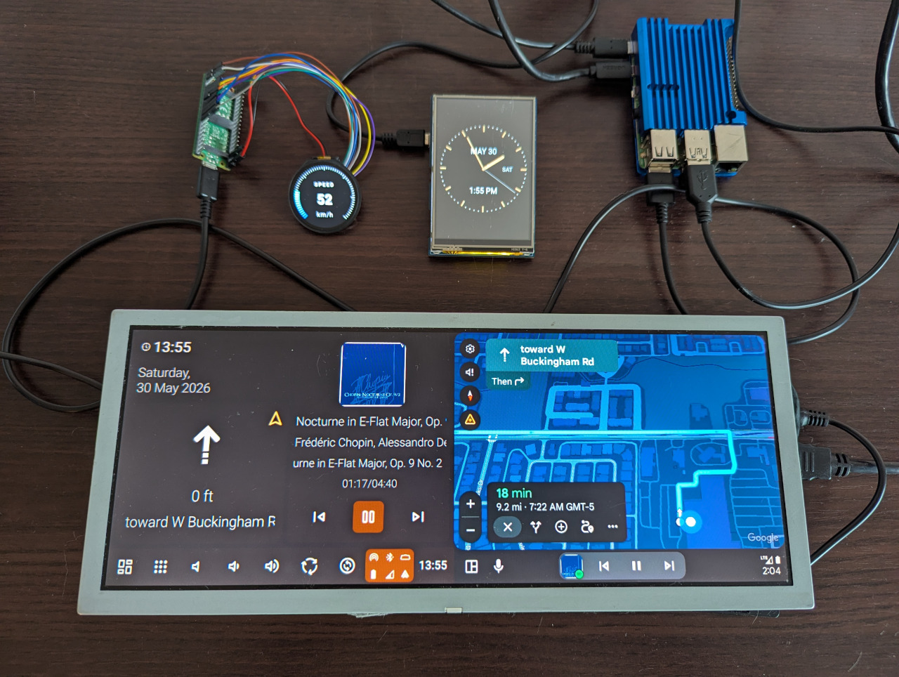
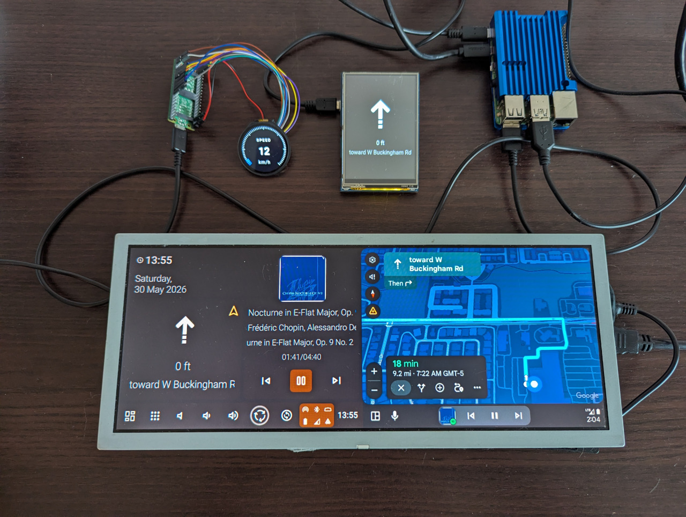
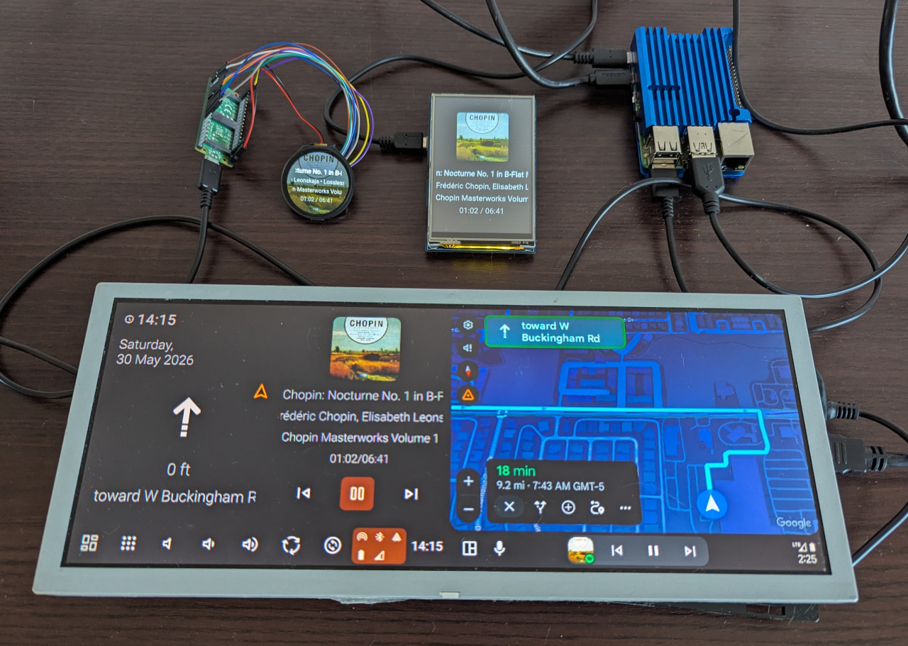
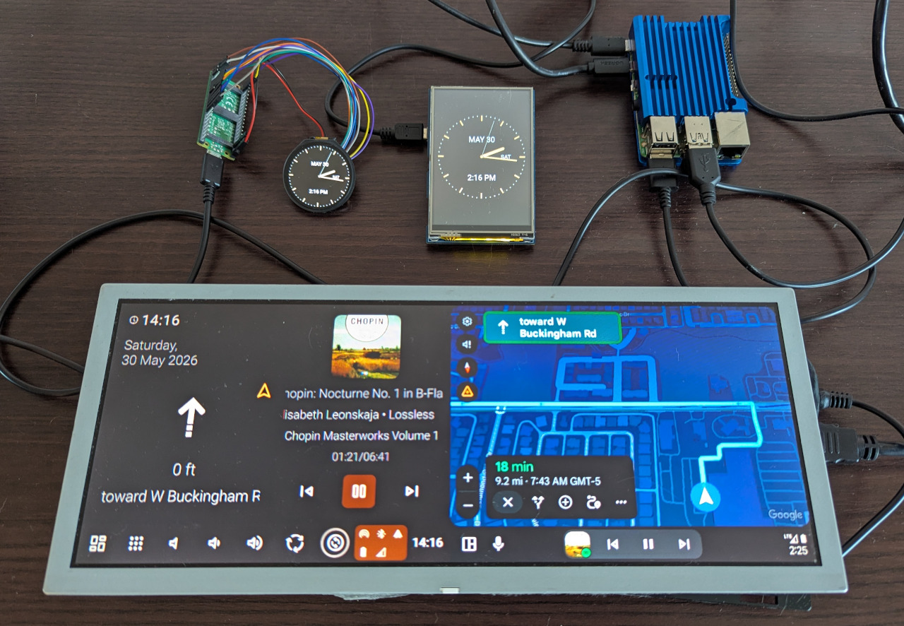
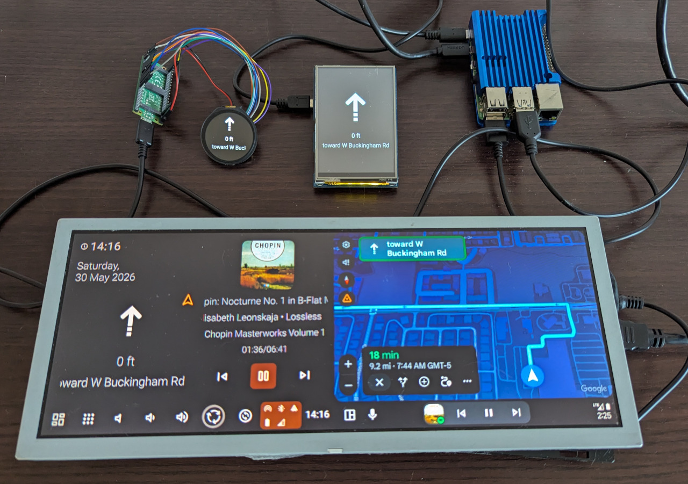
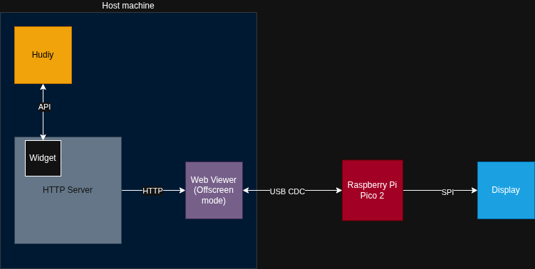
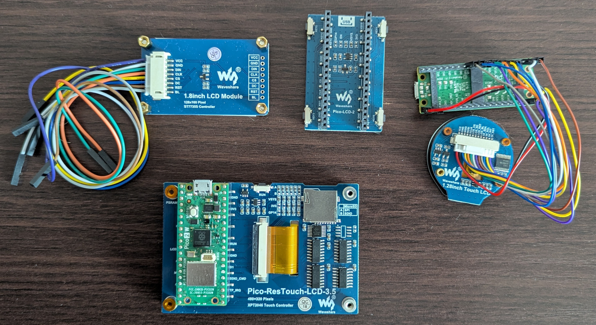

# Description

This directory contains an example of using an external display driven by Raspberry Pi Pico 2 to render image data from [Web Viewer's](../../README.md#web-viewer) offscreen mode. The example consists of two components:

- Raspberry Pi Pico 2 firmware
- HTML/JavaScript frontend, which includes:
    - A simple Driver Information System (DIS) UI for rounded and rectangular displays
    - Two styles of OBD-II gauges for rounded displays

The widgets and Raspberry Pi Pico 2 firmware are independent. You can use the firmware on the Pico to display any URL using the Web Viewer.

<table style="width:100%">
  <tr>
    <td></td>
    <td></td>
    <td></td>
  </tr>
  <tr>
    <td></td>
    <td></td>
    <td></td>
  </tr>
</table>

## Architecture

The primary benefit of this architecture is the ability to easily use SPI screens. Since the SPI interface is very sensitive to cable length, utilizing the Pi Pico 2 as a display controller keeps the SPI cables very short. Thanks to USB communication with the host machine (running Hudiy and Web Viewer), the distance to the screen can be significantly increased (up to 3 meters, depending on USB cable quality).



- **HTTP Server**  
The HTTP server is used to host widgets. Due to the Same-Origin Policy, widgets must be hosted on an HTTP server.

- **Widget**  
The actual component in the form of an HTML/JavaScript web page rendered by Web Viewer.

- **Hudiy**  
Widgets communicate with Hudiy via an API to retrieve information such as media metadata, navigation maneuvers, OBD-II data, or action registrations.

- **Web Viewer**  
A component that renders the provided widget URL using the Chromium engine and then transmits the image as a JPEG to the Raspberry Pi Pico 2 over USB CDC.

- **Raspberry Pi Pico 2**  
Raspberry Pi Pico 2 decodes the received image frames from Web Viewer and outputs them to the display over SPI.

- **Display**  
An SPI display controlled by the Raspberry Pi Pico 2.

## HTML/JavaScript

The example includes 4 widgets. All widgets communicate with Hudiy via an API to retrieve media metadata, navigation maneuvers, and OBD-II data, as well as to register actions such as `switch_view` and `switch_gauge` to switch the view. These actions can be triggered, for example, by binding them to shortcuts on the Hudiy interface, or you can use the GPIO examples to create a hardware button that invokes them.

If you plan to run multiple instances of the widgets, you must ensure that all action names are [unique](../../README.md#defining-an-action).

- [dis.html](widget/dis.html)  
This example includes three screens optimized for rectangular displays: an analog clock, a media screen, and a navigation maneuver screen. Switching between screens is handled via the `switch_view` action.

- [dis_circle.html](widget/dis_circle.html)  
This example includes three screens optimized for rounded displays: an analog clock, a media screen, and a navigation maneuver screen. Switching between screens is handled via the `switch_view` action.

- [gauges.html](widget/gauges.html) and [gauges2.html](widget/gauges2.html)  
This example includes OBD-II gauges in various styles. The OBD-II data is fetched via the Hudiy API, and switching between gauges is handled via the `switch_gauge` action.

## Raspberry Pi Pico 2

The firmware is written in C/C++. It utilizes separate cores of the Raspberry Pi Pico 2 - one for receiving data over USB CDC, and the other for decoding and rendering the image on the display. Image data is transmitted to the display via DMA. The JPEG decoder uses SIMD instructions to accelerate decoding performance. These SIMD instructions are only supported by the RP2350 (Raspberry Pi Pico 2).

The Raspberry Pi Pico 2 automatically resets if the Web Viewer application on the host machine terminates.

The firmware project is compatible with the [Raspberry Pi Pico VS Code extension](https://www.raspberrypi.com/news/get-started-with-raspberry-pi-pico-series-and-vs-code/). You can also find pre-compiled firmware binaries for every supported display under the Releases section of the repository. The flashing procedure is described in Chapter 5.1 in the [Official Raspberry Pi Pico 2 datasheet](https://pip-assets.raspberrypi.com/categories/1005-raspberry-pi-pico-2/documents/RP-008299-DS-2-pico-2-datasheet.pdf).

### Supported displays

This example adapts four display drivers developed by Waveshare. The SPI clock speed for the 480x320 display has been boosted to 37.5 MHz in the driver.



- [Waveshare 480x320](https://www.waveshare.com/wiki/Pico-ResTouch-LCD-3.5)
- [Waveshare 320x240](http://www.waveshare.com/wiki/Pico-LCD-2)
- [Waveshare 240x240](https://www.waveshare.com/wiki/1.28inch_Touch_LCD)
- [Waveshare 128x160](https://www.waveshare.com/wiki/Pico-LCD-1.8)

If you plan to add support for a custom display, ensure that it is capable of incremental screen updates to achieve optimal smoothness.

## How to use

Running this example requires starting the HTTP server and Web Viewer, as well as connecting a Raspberry Pi Pico 2 with the selected firmware flashed to the host machine.

### HTTP Server

The easiest way to start an HTTP server on a Raspberry Pi OS/Debian is by using `node-http-server`. To install it, run:

```bash
sudo apt install -y node-opener node-http-server
```

Once installed, navigate to the `widget` directory and start the server with:

```bash
http-server -p 12345
```

***Note:** If you are already running an HTTP server, you can use it instead of starting a new instance.*

### Raspberry Pi Pico 2

You can find pre-compiled firmware binaries for every supported display under the Releases section of the repository. The flashing procedure is described in Chapter 5.1 in the [Official Raspberry Pi Pico 2 datasheet](https://pip-assets.raspberrypi.com/categories/1005-raspberry-pi-pico-2/documents/RP-008299-DS-2-pico-2-datasheet.pdf).

### Web Viewer

To run Web Viewer in offscreen mode for a specified URL, run the following command:

```bash
$HOME/.hudiy/share/web_viewer --url "http://127.0.0.1:12345/dis.html" --device_descriptor /dev/ttyACM0 --rendering_mode 2 --width 240 --height 320
```

If you are running Web Viewer via SSH, you need to set the following environment variables for Wayland:

```bash
export XDG_RUNTIME_DIR="/run/user/$UID"
export WAYLAND_DISPLAY="wayland-0"
```

If running in console mode, set the following environment variable:

```bash
export QT_QPA_PLATFORM=eglfs
```

***Note:** The `device_descriptor` must match the descriptor assigned to the Raspberry Pi Pico 2 by the system on host machine.*

***Note 2:** `width` and `height` must match the display resolution, otherwise rendering artifacts may occur on the display.*

***Note 3:** If you are using Hudiy and Web Viewer in console mode, Web Viewer should be configured to use EGLFS in headless mode to avoid blocking GPU resources. See [Autostart directory](autostart/README.md) for more details.*

### Autostart

Launching the HTTP server and Web Viewer can be added to the autostart configuration, for example, in `$HOME/.config/labwc/autostart`. Please note that if a communication error occurs (e.g., due to a cable disconnection or device reset), Web Viewer terminates with an error. This behavior can be leveraged for an automatic restart, but it requires a simple watchdog script or configuring Web Viewer as a systemd **user** service.

Check [Autostart directory](autostart/README.md) for autostart examples.

## Example configuration

Example configuration for shortcuts is available in the config directory.

## Remarks

- The USB controller on the Raspberry Pi 3B and 3B+ may experience issues when transferring large amounts of small data packets. If you notice the Web Viewer image freezing on your Raspberry Pi Pico 2, add these parameters to the end of your /boot/firmware/cmdline.txt (on the same line):  

    `dwc_otg.fiq_enable=0 dwc_otg.fiq_fsm_enable=0`

- We do not recommend running this example on the Raspberry Pi Zero 2 due to its limited amount of RAM.
