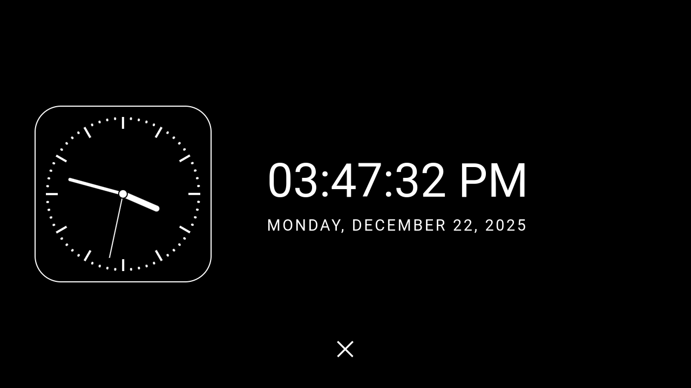

# Description

This directory contains an example of an idle screen. The example consists of two components:

- Python backend
- HTML/JavaScript with the idle screen UI

<br>



## HTML/JavaScript

HTML/JavaScript render an analog clock along with a digital date and time. The overlay includes a `close` button to hide it. It will also hide automatically upon an incoming voice call.

The `close` button supports both touch and input events from Hudiy. Clicking the `close` button sends a `GET /hide` request to the Python backend.

The locale for the date and time can be configured directly in the source code (the default is `en-US`).

## Python

The Python backend registers the `show_idle_overlay` action using the Hudiy API, which can then be triggered via a shortcut or an item in the applications menu.

Once the action is triggered, the backend sets `OVERLAY_VISIBILITY_ALWAYS` for the `idle_overlay`. Receiving the `GET /hide` request from the frontend sets it to `OVERLAY_VISIBILITY_NONE`.

## Dependecies

To use the script, the following dependencies must be installed:

```bash
sudo apt install -y python3-flask python3-flask-cors python3-jinja2 python3-protobuf python3-websocket
```

## How to run

After installing dependencies simply run

```bash
python3 idle_screen.py
```

### Autostart

The script can be configured to run automatically at system startup, for example, by adding it to **$HOME/.config/labwc/autostart** (before Hudiy startup)

```bash
python3 /home/pi/hudiy/examples/idle_screen/idle_screen.py &
```

*Note: Update the path to idle_screen.py to match your local file location.*

## Example configuration

Example configurations for overlays and shortcuts are available in the config directory. You can also add an trigger to the applications menu (`applications_menu.json`).

*Note: Adjust the width and height of the overlay in `overlays.json` to make it full-screen on your display.*
