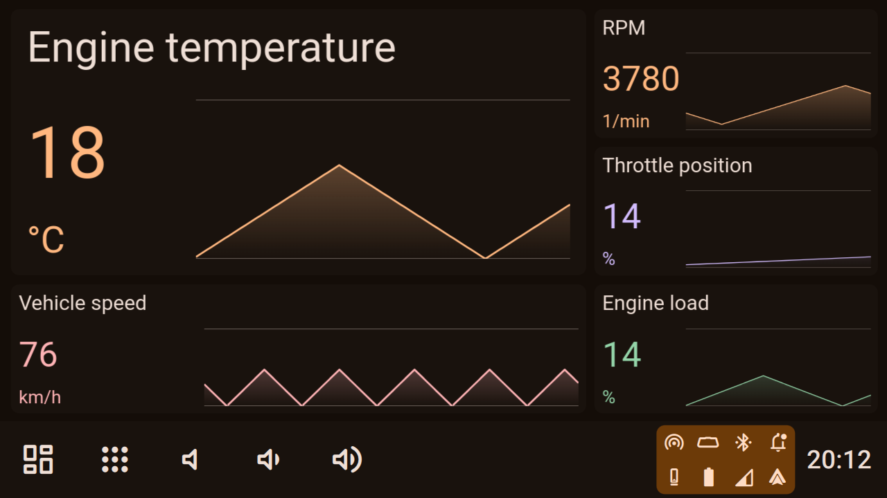
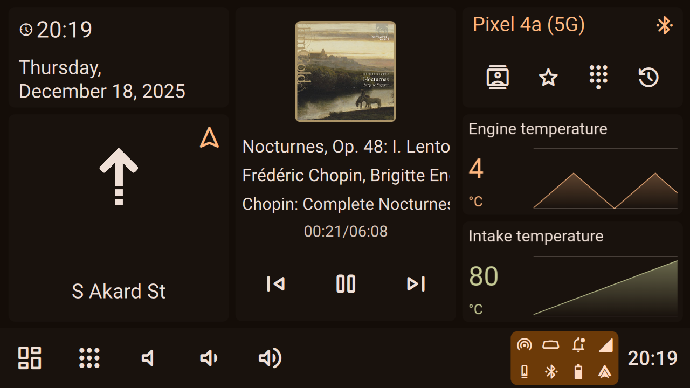
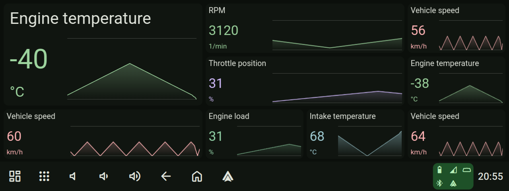

# Description

This directory contains a set of widgets for displaying OBD-II data retrieved from ELM327. Communication with the ELM327 is handled via the Hudiy API.

OBD Charts consist of two components:

- Python backend
- HTML/JavaScript widgets of various style

<br>









## HTML/JavaScript

The widgets communicate with the Python backend via a simple REST API. The API allows for retrieving the measurement history for a specific PID stored in the backend, as well as querying for the current value of a given PID.

Polling frequency, PID, colors, labels, and other customizations can be configured directly in the widgets source code.

## Python

The Python backend features a simple Flask HTTP server that serves both the widgets and the REST API.

Through the REST API, widgets can retrieve measurement history via the GET /history endpoint and the current PID value via GET /value.

The Hudiy API is used to fetch PID data from the ELM327 device.

The measurement history size (capacity) is configurable directly within the source code.

## Dependecies

To use the script, the following dependencies must be installed:

```bash
sudo apt install -y python3-flask python3-flask-cors python3-jinja2 python3-protobuf python3-websocket
```

## How to run

After installing dependencies simply run

```bash
python3 charts.py
```

### Autostart

The script can be configured to run automatically at system startup, for example, by adding it to **$HOME/.config/labwc/autostart** (before Hudiy startup)

```bash
python3 /home/pi/hudiy/examples/obd_charts/charts.py &
```

*Note: Update the path to charts.py to match your local file location.*

## Example configuration

Example configuration of dashboards and applications menu is available in config directory.
